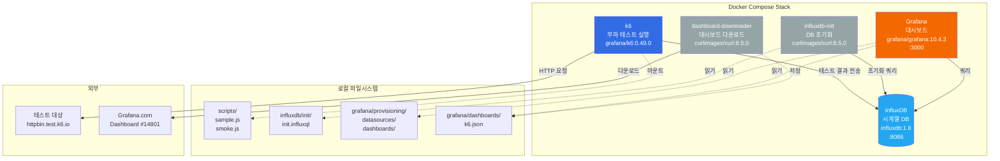
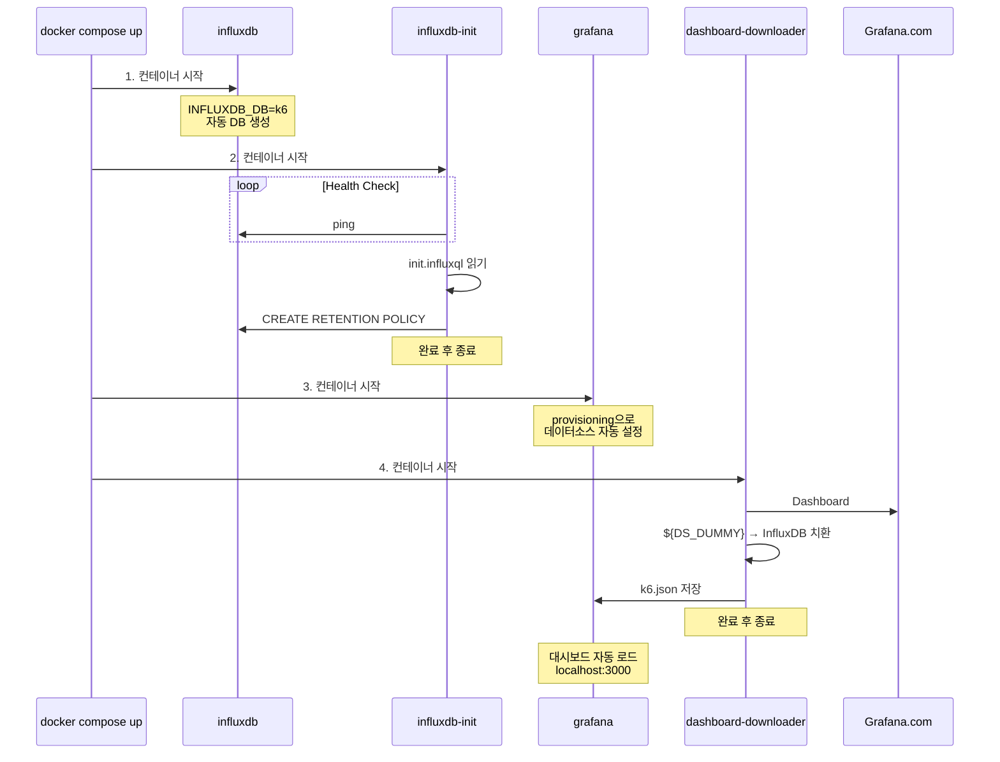
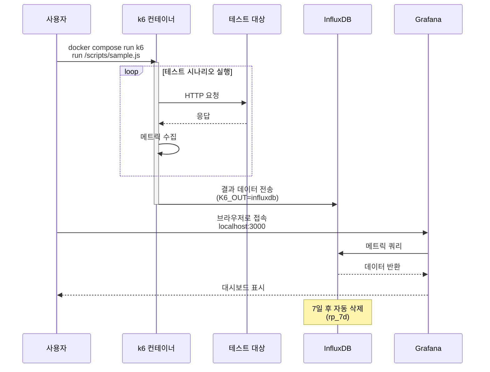

# K6 Load Testing Stack

K6 + InfluxDB + Grafana를 사용한 현대적인 부하 테스트 환경

## 🎯 K6란?

[K6](https://k6.io/)는 Grafana Labs에서 개발한 오픈소스 부하 테스트 도구로, 개발자 친화적이고 확장 가능한 성능 테스트를 제공합니다.


### 왜 K6를 선택해야 할까?

#### ✅ **개발자 중심 경험**
- **JavaScript/TypeScript로 작성**: 별도의 DSL이 아닌 친숙한 언어 사용
- **로컬에서 실행 가능**: Docker 없이도 CLI로 바로 실행
- **버전 관리 친화적**: 테스트 스크립트를 코드로 관리

#### ⚡ **높은 성능**
- **Go 기반**: 경량화되고 빠른 실행 속도
- **적은 리소스**: 단일 머신에서 수만 명의 가상 사용자 생성 가능
- **CLI 실행**: GUI 없이 가볍게 실행

#### 📊 **풍부한 메트릭과 시각화**
- **실시간 메트릭**: 응답 시간, 처리량, 에러율 등
- **여러 출력 포맷**: InfluxDB, Prometheus, JSON, CSV 등
- **Grafana 통합**: 실시간 대시보드로 테스트 결과 모니터링

#### 🎨 **다양한 테스트 시나리오**
```javascript
// Smoke Test - 기본 동작 확인
export const options = {
  vus: 1,
  duration: '1m'
};

// Load Test - 일반적인 부하
export const options = {
  stages: [
    { duration: '5m', target: 100 },
    { duration: '10m', target: 100 },
    { duration: '5m', target: 0 }
  ]
};

// Stress Test - 한계 테스트
export const options = {
  stages: [
    { duration: '2m', target: 100 },
    { duration: '5m', target: 100 },
    { duration: '2m', target: 200 },
    { duration: '5m', target: 200 },
    { duration: '2m', target: 300 },
    { duration: '5m', target: 300 },
    { duration: '10m', target: 0 }
  ]
};

// Spike Test - 급격한 트래픽 증가
export const options = {
  stages: [
    { duration: '10s', target: 100 },
    { duration: '1m', target: 100 },
    { duration: '10s', target: 1400 },
    { duration: '3m', target: 1400 },
    { duration: '10s', target: 100 },
    { duration: '3m', target: 100 },
    { duration: '10s', target: 0 }
  ]
};
```

#### 🔄 **CI/CD 통합**
- **자동화 친화적**: CLI 기반으로 파이프라인에 쉽게 통합
- **Threshold 설정**: 성능 기준 미달 시 빌드 실패 처리
- **다양한 플랫폼**: GitHub Actions, GitLab CI, Jenkins 등

```javascript
export const options = {
  thresholds: {
    http_req_duration: ['p(95)<500'],  // 95%가 500ms 미만
    http_req_failed: ['rate<0.01'],    // 에러율 1% 미만
  }
};
```


### 다른 도구와의 비교

| 특징 | K6 | JMeter | Locust | Gatling |
|------|-----|---------|---------|----------|
| 언어 | JavaScript | GUI/XML | Python | Scala |
| 리소스 사용 | 매우 낮음 | 높음 | 중간 | 중간 |
| CLI 지원 | ✅ 우수 | ⚠️ 제한적 | ✅ 우수 | ✅ 우수 |
| 학습 곡선 | 낮음 | 높음 | 낮음 | 중간 |
| 코드형 테스트 | ✅ | ⚠️ | ✅ | ✅ |
| CI/CD 통합 | ✅ 쉬움 | ⚠️ 복잡 | ✅ 쉬움 | ✅ 쉬움 |
| 확장성 | 높음 | 중간 | 중간 | 높음 |
| 커뮤니티 | 성장 중 | 매우 큼 | 중간 | 중간 |

### K6의 주요 기능

#### 1. **HTTP/HTTPS 테스트**
```javascript
import http from 'k6/http';

export default function() {
  http.get('https://api.example.com/users');
  http.post('https://api.example.com/login', {
    username: 'user',
    password: 'pass'
  });
}
```

#### 2. **WebSocket 지원**
```javascript
import ws from 'k6/ws';

export default function() {
  ws.connect('ws://example.com/socket', function(socket) {
    socket.on('open', () => socket.send('hello'));
    socket.on('message', (data) => console.log(data));
  });
}
```

#### 3. **GraphQL 테스트**
```javascript
import http from 'k6/http';
import { check } from 'k6';

export default function() {
  const query = `
    query GetUser($id: ID!) {
      user(id: $id) {
        id
        name
        email
      }
    }
  `;

  const variables = { id: '123' };

  const res = http.post('https://api.example.com/graphql',
    JSON.stringify({ query, variables }),
    {
      headers: { 'Content-Type': 'application/json' },
    }
  );

  check(res, {
    'status is 200': (r) => r.status === 200,
    'no errors': (r) => !r.json().errors,
    'user returned': (r) => r.json().data.user !== null,
  });
}

// Mutation 예제
export function createUser() {
  const mutation = `
    mutation CreateUser($input: CreateUserInput!) {
      createUser(input: $input) {
        id
        name
        email
      }
    }
  `;

  const variables = {
    input: {
      name: 'John Doe',
      email: 'john@example.com',
    },
  };

  const res = http.post('https://api.example.com/graphql',
    JSON.stringify({ query: mutation, variables }),
    {
      headers: {
        'Content-Type': 'application/json',
        'Authorization': 'Bearer token123',
      },
    }
  );

  check(res, {
    'user created': (r) => r.json().data.createUser.id !== null,
  });
}
```

#### 4. **gRPC 테스트**
```javascript
import grpc from 'k6/net/grpc';

const client = new grpc.Client();
client.load(['definitions'], 'service.proto');

export default function() {
  client.connect('localhost:8080', { plaintext: true });
  const response = client.invoke('main.Service/Method', { field: 'value' });
}
```

#### 5. **체크와 임계값**
```javascript
import { check } from 'k6';
import http from 'k6/http';

export default function() {
  const res = http.get('https://api.example.com');

  check(res, {
    'status is 200': (r) => r.status === 200,
    'response time < 200ms': (r) => r.timings.duration < 200,
    'body contains data': (r) => r.body.includes('data')
  });
}
```

#### 6. **사용자 정의 메트릭**
```javascript
import { Counter, Trend } from 'k6/metrics';

const errorCounter = new Counter('errors');
const customTrend = new Trend('custom_wait_time');

export default function() {
  errorCounter.add(1);
  customTrend.add(100);
}
```

### 이 스택을 사용하는 이유

이 K6 스택은 다음과 같은 장점을 제공합니다:

1. **즉시 시작 가능**: `docker compose up -d` 한 번으로 전체 환경 구축
2. **실시간 시각화**: Grafana 대시보드로 테스트 진행 상황 실시간 모니터링
3. **데이터 보존**: InfluxDB로 테스트 결과 저장 및 비교 분석
4. **완전 자동화**: DB 초기화, 대시보드 설정 등 모두 자동
5. **확장 가능**: 분산 테스트로 확장 가능

## ⚙️ K6 Options 완벽 가이드

K6의 `options` 객체는 테스트의 동작을 제어하는 핵심 설정입니다. 다양한 옵션을 통해 부하 패턴, 성능 임계값, 네트워크 설정 등을 세밀하게 조정할 수 있습니다.

### 1. 기본 실행 옵션

#### `vus` (Virtual Users)
동시 실행할 가상 사용자 수를 지정합니다.

```javascript
export const options = {
  vus: 10,          // 10명의 가상 사용자
  duration: '30s',  // 30초 동안 실행
};
```

1#### `duration`
테스트 실행 시간을 지정합니다. (s: 초, m: 분, h: 시간)

```javascript
export const options = {
  duration: '5m',   // 5분
  // duration: '1h30m',  // 1시간 30분
};
```

#### `iterations`
각 VU가 실행할 총 반복 횟수를 지정합니다.

```javascript
export const options = {
  vus: 10,
  iterations: 100,  // 총 100번 실행 (VU당 10번씩)
};
```

### 2. Stages (단계별 부하 조절)

시간에 따라 VU 수를 동적으로 조절하여 다양한 부하 패턴을 만듭니다.

```javascript
export const options = {
  stages: [
    { duration: '30s', target: 20 },   // 30초 동안 0 → 20 VUs로 증가
    { duration: '1m', target: 20 },    // 1분 동안 20 VUs 유지
    { duration: '30s', target: 50 },   // 30초 동안 20 → 50 VUs로 증가
    { duration: '2m', target: 50 },    // 2분 동안 50 VUs 유지
    { duration: '30s', target: 0 },    // 30초 동안 50 → 0 VUs로 감소
  ],
};
```

**실제 사용 예제:**

```javascript
// Spike Test (급격한 트래픽 증가)
export const options = {
  stages: [
    { duration: '10s', target: 100 },   // 정상 트래픽
    { duration: '1m', target: 100 },
    { duration: '10s', target: 1000 },  // 급격한 증가
    { duration: '3m', target: 1000 },
    { duration: '10s', target: 100 },   // 정상 복귀
    { duration: '3m', target: 100 },
    { duration: '10s', target: 0 },
  ],
};
```

### 3. Scenarios (시나리오)

여러 테스트를 동시에 실행하거나 복잡한 워크로드를 시뮬레이션할 때 사용합니다.

```javascript
export const options = {
  scenarios: {
    // 시나리오 1: 일반 사용자 트래픽
    normal_users: {
      executor: 'ramping-vus',
      startVUs: 0,
      stages: [
        { duration: '1m', target: 50 },
        { duration: '5m', target: 50 },
        { duration: '1m', target: 0 },
      ],
      gracefulRampDown: '30s',
      exec: 'normalUser',  // 실행할 함수
    },

    // 시나리오 2: 관리자 트래픽
    admin_users: {
      executor: 'constant-vus',
      vus: 5,
      duration: '7m',
      exec: 'adminUser',
      startTime: '30s',  // 30초 후 시작
    },

    // 시나리오 3: API 헬스체크
    health_check: {
      executor: 'constant-arrival-rate',
      rate: 10,           // 초당 10번 실행
      timeUnit: '1s',
      duration: '7m',
      preAllocatedVUs: 2,
      exec: 'healthCheck',
    },
  },
};

// 각 시나리오에서 실행될 함수들
export function normalUser() {
  // 일반 사용자 로직
}

export function adminUser() {
  // 관리자 로직
}

export function healthCheck() {
  // 헬스체크 로직
}
```

### 4. Executors (실행 방식)

#### `shared-iterations`
정해진 반복 횟수를 모든 VU가 공유합니다.

```javascript
export const options = {
  scenarios: {
    shared_iter: {
      executor: 'shared-iterations',
      vus: 10,
      iterations: 100,  // 10명의 VU가 총 100번을 나눠서 실행
      maxDuration: '10m',
    },
  },
};
```

#### `per-vu-iterations`
각 VU가 정해진 횟수만큼 반복합니다.

```javascript
export const options = {
  scenarios: {
    per_vu_iter: {
      executor: 'per-vu-iterations',
      vus: 10,
      iterations: 10,  // 각 VU가 10번씩, 총 100번 실행
      maxDuration: '10m',
    },
  },
};
```

#### `constant-vus`
일정한 VU 수를 유지합니다.

```javascript
export const options = {
  scenarios: {
    constant_load: {
      executor: 'constant-vus',
      vus: 50,
      duration: '10m',
    },
  },
};
```

#### `ramping-vus`
시간에 따라 VU 수를 조절합니다 (stages와 유사).

```javascript
export const options = {
  scenarios: {
    ramping_load: {
      executor: 'ramping-vus',
      startVUs: 0,
      stages: [
        { duration: '2m', target: 100 },
        { duration: '5m', target: 100 },
        { duration: '2m', target: 0 },
      ],
      gracefulRampDown: '30s',
    },
  },
};
```

#### `constant-arrival-rate`
일정한 요청률(RPS)을 유지합니다.

```javascript
export const options = {
  scenarios: {
    constant_rps: {
      executor: 'constant-arrival-rate',
      rate: 100,              // 초당 100번 실행
      timeUnit: '1s',
      duration: '10m',
      preAllocatedVUs: 50,    // 미리 할당할 VU 수
      maxVUs: 100,            // 최대 VU 수
    },
  },
};
```

#### `ramping-arrival-rate`
시간에 따라 요청률을 조절합니다.

```javascript
export const options = {
  scenarios: {
    ramping_rps: {
      executor: 'ramping-arrival-rate',
      startRate: 50,          // 시작 요청률 (초당 50번)
      timeUnit: '1s',
      preAllocatedVUs: 50,
      maxVUs: 200,
      stages: [
        { duration: '2m', target: 100 },  // 초당 100번으로 증가
        { duration: '5m', target: 200 },  // 초당 200번으로 증가
        { duration: '2m', target: 0 },    // 0으로 감소
      ],
    },
  },
};
```

#### `externally-controlled`
외부에서 실행 시간과 VU 수를 동적으로 조절합니다.

```javascript
export const options = {
  scenarios: {
    external: {
      executor: 'externally-controlled',
      vus: 10,
      maxVUs: 100,
      duration: '30m',
    },
  },
};
```

### 5. Thresholds (성능 임계값)

테스트가 성공/실패를 판단하는 기준을 설정합니다.

```javascript
export const options = {
  thresholds: {
    // HTTP 요청 실패율이 1% 미만이어야 함
    http_req_failed: ['rate<0.01'],

    // 응답 시간 기준
    http_req_duration: [
      'p(95)<500',    // 95%가 500ms 미만
      'p(99)<1000',   // 99%가 1초 미만
      'avg<300',      // 평균 300ms 미만
      'med<250',      // 중앙값 250ms 미만
      'min<100',      // 최소값 100ms 미만
      'max<2000',     // 최대값 2초 미만
    ],

    // 특정 엔드포인트에 대한 임계값
    'http_req_duration{name:login}': ['p(95)<800'],
    'http_req_duration{name:checkout}': ['p(99)<2000'],

    // 초당 요청 수
    http_reqs: ['rate>100'],  // 초당 100개 이상

    // 데이터 전송량
    data_received: ['rate>10000'],  // 초당 10KB 이상
    data_sent: ['rate>5000'],       // 초당 5KB 이상

    // VU 관련
    vus: ['value>10'],        // 항상 10명 이상 유지
    vus_max: ['value<200'],   // 최대 200명 이하

    // Iteration 관련
    iterations: ['count>1000'],           // 총 1000번 이상 실행
    iteration_duration: ['avg<1000'],     // 평균 1초 미만

    // 사용자 정의 메트릭에 대한 임계값
    'custom_metric': ['p(95)<1000', 'avg<500'],
  },
};
```

**중단 조건 추가:**

```javascript
export const options = {
  thresholds: {
    // abortOnFail: true - 임계값 실패 시 즉시 테스트 중단
    http_req_failed: [
      { threshold: 'rate<0.01', abortOnFail: true },
    ],

    // delayAbortEval: '1m' - 1분 후부터 임계값 평가
    http_req_duration: [
      { threshold: 'p(95)<500', abortOnFail: false, delayAbortEval: '1m' },
    ],
  },
};
```

### 6. 태그와 그룹

요청에 태그를 붙여 필터링하고 분석할 수 있습니다.

```javascript
import { group } from 'k6';
import http from 'k6/http';

export const options = {
  thresholds: {
    // 특정 그룹의 duration
    'group_duration{group:::API}': ['avg<1000'],

    // 특정 태그의 요청
    'http_req_duration{status:200}': ['p(95)<500'],
    'http_req_duration{endpoint:login}': ['p(99)<800'],
  },

  tags: {
    // 모든 메트릭에 적용될 기본 태그
    testid: 'stress-test-001',
    environment: 'staging',
  },
};

export default function() {
  group('API', function() {
    http.get('https://api.example.com/users', {
      tags: { endpoint: 'login', name: 'login' },
    });
  });

  group('Frontend', function() {
    http.get('https://example.com', {
      tags: { endpoint: 'homepage' },
    });
  });
}
```

### 7. HTTP 옵션

```javascript
export const options = {
  // HTTP 설정
  batch: 10,                    // 동시에 보낼 최대 요청 수
  batchPerHost: 5,             // 호스트당 동시 요청 수

  httpDebug: 'full',           // HTTP 디버그 레벨 (full, headers, none)

  // 타임아웃 설정
  http: {
    timeout: '30s',            // 전체 타임아웃
    connectTimeout: '10s',     // 연결 타임아웃
    handshakeTimeout: '10s',   // TLS 핸드셰이크 타임아웃
  },

  // 연결 재사용
  noConnectionReuse: false,    // false면 Keep-Alive 사용

  // 쿠키 자동 처리
  noCookiesReset: false,       // iteration 간 쿠키 유지

  // 리다이렉트
  maxRedirects: 10,            // 최대 리다이렉트 횟수

  // User Agent
  userAgent: 'K6-LoadTest/1.0',
};
```

### 8. 출력 및 모니터링 옵션

```javascript
export const options = {
  // 요약 출력 설정
  summaryTrendStats: ['avg', 'min', 'med', 'max', 'p(90)', 'p(95)', 'p(99)'],

  // 요약 시간 단위
  summaryTimeUnit: 'ms',  // ms, s

  // 경고 비활성화
  noVUConnectionReuse: false,

  // 시스템 태그 비활성화
  systemTags: ['proto', 'subproto', 'status', 'method', 'url', 'name', 'group', 'check', 'error'],

  // 콘솔 출력 제어
  noColor: false,              // 색상 출력

  // 로그 출력
  logOutput: 'stdout',         // stdout, stderr, file
};
```

### 9. 성능 최적화 옵션

```javascript
export const options = {
  // DNS 캐싱
  dns: {
    ttl: '5m',                 // DNS 캐시 TTL
    select: 'first',           // first, random, roundRobin
    policy: 'preferIPv4',      // preferIPv4, preferIPv6, onlyIPv4, onlyIPv6, any
  },

  // VU 라이프사이클
  setupTimeout: '60s',         // setup() 함수 타임아웃
  teardownTimeout: '60s',      // teardown() 함수 타임아웃

  // 리소스 제한
  maxRedirects: 10,

  // 실행 환경
  compatibilityMode: 'base',   // base, extended
};
```

### 10. Cloud 옵션 (K6 Cloud 사용 시)

```javascript
export const options = {
  ext: {
    loadimpact: {
      projectID: 123456,
      name: 'My Load Test',
      distribution: {
        'amazon:us:ashburn': { loadZone: 'amazon:us:ashburn', percent: 50 },
        'amazon:ie:dublin': { loadZone: 'amazon:ie:dublin', percent: 50 },
      },
    },
  },
};
```

### 11. 실전 예제

#### 예제 1: E-commerce 부하 테스트

```javascript
import http from 'k6/http';
import { check, sleep } from 'k6';

export const options = {
  scenarios: {
    // 일반 사용자: 상품 조회
    browse: {
      executor: 'ramping-vus',
      startVUs: 0,
      stages: [
        { duration: '5m', target: 100 },
        { duration: '30m', target: 100 },
        { duration: '5m', target: 0 },
      ],
      gracefulRampDown: '30s',
      exec: 'browseProducts',
    },

    // 구매 사용자: 체크아웃
    purchase: {
      executor: 'constant-arrival-rate',
      rate: 10,           // 초당 10건 구매
      timeUnit: '1s',
      duration: '40m',
      preAllocatedVUs: 20,
      maxVUs: 50,
      exec: 'purchaseFlow',
    },

    // 검색 부하
    search: {
      executor: 'ramping-arrival-rate',
      startRate: 50,
      timeUnit: '1s',
      preAllocatedVUs: 50,
      maxVUs: 200,
      stages: [
        { duration: '10m', target: 100 },
        { duration: '20m', target: 200 },
        { duration: '10m', target: 50 },
      ],
      exec: 'searchProducts',
    },
  },

  thresholds: {
    // 전체 HTTP 요청
    http_req_failed: ['rate<0.01'],
    http_req_duration: ['p(95)<2000', 'p(99)<3000'],

    // 상품 조회
    'http_req_duration{name:products}': ['p(95)<500'],

    // 검색
    'http_req_duration{name:search}': ['p(95)<800'],

    // 체크아웃
    'http_req_duration{name:checkout}': [
      'p(95)<2000',
      { threshold: 'p(99)<3000', abortOnFail: true },
    ],
  },

  tags: {
    testid: 'ecommerce-load-test',
    environment: 'production',
  },
};

export function browseProducts() {
  const res = http.get('https://shop.example.com/api/products', {
    tags: { name: 'products' },
  });
  check(res, { 'status is 200': (r) => r.status === 200 });
  sleep(1);
}

export function searchProducts() {
  const res = http.get('https://shop.example.com/api/search?q=laptop', {
    tags: { name: 'search' },
  });
  check(res, { 'status is 200': (r) => r.status === 200 });
  sleep(0.5);
}

export function purchaseFlow() {
  // 장바구니 추가
  http.post('https://shop.example.com/api/cart');
  sleep(1);

  // 체크아웃
  const res = http.post('https://shop.example.com/api/checkout', {
    tags: { name: 'checkout' },
  });
  check(res, { 'purchase successful': (r) => r.status === 200 });
  sleep(2);
}
```

#### 예제 2: API Stress Test

```javascript
export const options = {
  scenarios: {
    stress: {
      executor: 'ramping-arrival-rate',
      startRate: 10,
      timeUnit: '1s',
      preAllocatedVUs: 50,
      maxVUs: 500,
      stages: [
        { duration: '2m', target: 10 },    // 워밍업
        { duration: '5m', target: 50 },    // 정상 부하
        { duration: '5m', target: 100 },   // 증가
        { duration: '5m', target: 200 },   // 스트레스
        { duration: '5m', target: 300 },   // 한계 테스트
        { duration: '2m', target: 0 },     // 쿨다운
      ],
    },
  },

  thresholds: {
    http_req_failed: [
      'rate<0.05',  // 5% 미만
      { threshold: 'rate<0.1', abortOnFail: true, delayAbortEval: '1m' },
    ],
    http_req_duration: [
      'p(95)<1000',
      'p(99)<2000',
    ],
  },
};
```

### 12. CLI에서 옵션 오버라이드

스크립트 파일의 옵션을 CLI에서 덮어쓸 수 있습니다:

```bash
# VU 수와 duration 변경
k6 run --vus 50 --duration 10m script.js

# Stage 설정
k6 run --stage 5m:100,10m:200,5m:0 script.js

# 환경 변수 전달
k6 run -e API_URL=https://api.example.com script.js

# 출력 대상 변경
k6 run --out influxdb=http://localhost:8086/k6 script.js

# 여러 옵션 조합
k6 run --vus 100 --duration 30m \
  --out influxdb=http://localhost:8086/k6 \
  --summary-export=summary.json \
  script.js
```

## 📊 아키텍처



## 🔄 초기화 플로우



## 🧪 테스트 실행 플로우



## 📁 디렉토리 구조

```
k6-stack/
├── docker-compose.yml          # 전체 스택 구성
├── grafana/
│   ├── dashboards/
│   │   └── k6.json            # K6 대시보드 (자동 다운로드)
│   └── provisioning/
│       ├── dashboards/
│       │   └── dashboards.yml  # 대시보드 프로비저닝
│       └── datasources/
│           └── datasource.yml  # InfluxDB 연결 설정
├── influxdb/
│   └── init/
│       └── init.influxql       # 초기화 쿼리 (Retention Policy)
└── scripts/
    ├── sample.js               # 기본 샘플 테스트
    └── smoke.js                # Ramping VUs 시나리오
```

## 🚀 사용 방법

### 1. 스택 시작
```bash
docker compose up -d
```

실행 순서:
1. InfluxDB 시작 (DB 자동 생성)
2. influxdb-init 실행 (Retention Policy 설정)
3. Grafana 시작 (데이터소스 자동 연결)
4. dashboard-downloader 실행 (대시보드 자동 다운로드)

### 2. K6 테스트 실행
```bash
# 샘플 테스트 (5 VUs, 10초)
docker compose run --rm k6 run /scripts/sample.js

# 스모크 테스트 (Ramping VUs)
docker compose run --rm k6 run /scripts/smoke.js
```

### 3. Grafana 대시보드 확인
- URL: http://localhost:3000
- 계정: admin / admin
- 위치: Dashboards > k6 폴더 > k6 Dashboard

### 4. 스택 중지
```bash
docker compose down          # 컨테이너만 삭제
docker compose down -v       # 데이터까지 삭제
```

## 🔧 서비스 상세

### influxdb (포트: 8086)
- **역할**: K6 테스트 결과 저장
- **이미지**: influxdb:1.8
- **데이터베이스**: k6 (환경변수로 자동 생성)
- **Retention Policy**: 7일 후 자동 삭제
- **볼륨**: influxdb-data (영구 저장)

### influxdb-init (일회성)
- **역할**: InfluxDB 초기화
- **동작**:
  1. InfluxDB 준비 대기 (health check)
  2. `influxdb/init/init.influxql` 읽기
  3. Retention Policy 생성
  4. 완료 후 자동 종료

### grafana (포트: 3000)
- **역할**: 테스트 결과 시각화
- **이미지**: grafana/grafana:10.4.3
- **계정**: admin / admin
- **자동 설정**:
  - 데이터소스: InfluxDB 자동 연결
  - 대시보드: k6 폴더에 자동 로드

### dashboard-downloader (일회성)
- **역할**: Grafana 대시보드 자동 다운로드
- **동작**:
  1. Grafana.com에서 Dashboard #14801 다운로드
  2. 데이터소스 이름 치환: `${DS_DUMMY}` → `InfluxDB`
  3. `grafana/dashboards/k6.json`에 저장
  4. 완료 후 자동 종료

### k6 (수동 실행)
- **역할**: 부하 테스트 실행
- **이미지**: grafana/k6:0.49.0
- **실행 방식**: `docker compose run --rm k6 run <스크립트>`
- **결과 전송**: InfluxDB로 자동 전송 (K6_OUT 환경변수)

## 📝 테스트 스크립트

### sample.js - 기본 샘플 테스트
```javascript
vus: 5
duration: 10s
thresholds:
  - 에러율 < 1%
  - p95 응답시간 < 500ms
```

### smoke.js - Ramping VUs 시나리오
```javascript
stages:
  - 10s: 0 → 10 VUs (증가)
  - 20s: 10 VUs (유지)
  - 10s: 10 → 0 VUs (감소)
thresholds:
  - 에러율 < 1%
  - p95 응답시간 < 300ms
```

## 🔑 핵심 특징

- ✅ **완전 자동화**: DB 초기화, 대시보드 다운로드, 데이터소스 연결 모두 자동
- ✅ **데이터 관리**: 7일 보존 정책으로 디스크 용량 자동 관리
- ✅ **즉시 사용**: `docker compose up -d` 한 번으로 전체 스택 구동
- ✅ **격리된 환경**: k6net 네트워크에서 안전하게 통신
- ✅ **영구 저장**: Docker volume으로 데이터 유지

## 🛠 커스터마이징

### Retention Policy 변경
`influxdb/init/init.influxql` 수정:
```sql
-- 30일 보존으로 변경
CREATE RETENTION POLICY "rp_30d" ON "k6" DURATION 30d REPLICATION 1 DEFAULT
```

### 새로운 테스트 스크립트 추가
`scripts/` 디렉토리에 `.js` 파일 추가 후:
```bash
docker compose run --rm k6 run /scripts/your-test.js
```

### Grafana 계정 변경
`docker-compose.yml`의 환경변수 수정:
```yaml
GF_SECURITY_ADMIN_USER: yourusername
GF_SECURITY_ADMIN_PASSWORD: yourpassword
```

## 📊 메트릭 확인

### InfluxDB 쿼리 (직접)
```bash
docker exec -it influxdb influx -database k6 -execute "SHOW MEASUREMENTS"
```

### Grafana 대시보드
- HTTP Request Duration (p95, p99)
- Request Rate (초당 요청 수)
- Error Rate (에러율)
- Virtual Users (동시 사용자 수)
- Check Success Rate (테스트 체크 성공률)

## ☸️ Kubernetes에서 K6 실행하기

K6 Operator를 사용하면 Kubernetes 클러스터에서 대규모 분산 부하 테스트를 실행할 수 있습니다.

### K6 Operator란?

[K6 Operator](https://github.com/grafana/k6-operator)는 Kubernetes Custom Resource Definition (CRD)을 사용하여 K6 테스트를 관리하는 Kubernetes Operator입니다.

**주요 장점:**
- ✅ **분산 실행**: 여러 Pod에서 테스트를 병렬 실행하여 높은 부하 생성
- ✅ **클러스터 리소스 활용**: Kubernetes의 오토스케일링 활용
- ✅ **선언적 관리**: YAML로 테스트를 정의하고 Git으로 관리
- ✅ **CI/CD 통합**: GitOps 워크플로우와 자연스러운 통합
- ✅ **리소스 격리**: Namespace로 테스트 환경 격리

### 설치 방법

#### 1. K6 Operator 설치 (Helm)

```bash
# Helm 저장소 추가
helm repo add grafana https://grafana.github.io/helm-charts
helm repo update

# k6-operator 설치
kubectl create namespace k6-operator-system
helm install k6-operator grafana/k6-operator \
  --namespace k6-operator-system
```

#### 2. Kustomize로 설치

```bash
kubectl apply -f https://github.com/grafana/k6-operator/releases/latest/download/bundle.yaml
```

### K6 테스트 리소스 정의

#### 기본 예제

```yaml
# k6-test.yaml
apiVersion: k6.io/v1alpha1
kind: K6
metadata:
  name: k6-sample
spec:
  parallelism: 4  # 4개의 Pod으로 분산 실행
  script:
    configMap:
      name: k6-test-script
      file: test.js
  runner:
    image: grafana/k6:0.49.0
    resources:
      limits:
        cpu: 500m
        memory: 512Mi
      requests:
        cpu: 250m
        memory: 256Mi
```

#### ConfigMap으로 스크립트 저장

```yaml
# k6-configmap.yaml
apiVersion: v1
kind: ConfigMap
metadata:
  name: k6-test-script
data:
  test.js: |
    import http from 'k6/http';
    import { check, sleep } from 'k6';

    export const options = {
      stages: [
        { duration: '1m', target: 100 },
        { duration: '3m', target: 100 },
        { duration: '1m', target: 0 },
      ],
      thresholds: {
        http_req_failed: ['rate<0.01'],
        http_req_duration: ['p(95)<500'],
      },
    };

    export default function() {
      const res = http.get('https://test.k6.io');
      check(res, {
        'status is 200': (r) => r.status === 200,
      });
      sleep(1);
    }
```

### 실행 및 모니터링

```bash
# ConfigMap 생성
kubectl apply -f k6-configmap.yaml

# K6 테스트 실행
kubectl apply -f k6-test.yaml

# 실행 상태 확인
kubectl get k6

# Pod 상태 확인
kubectl get pods -l k6_cr=k6-sample

# 로그 확인
kubectl logs -l k6_cr=k6-sample -f

# 테스트 결과 확인
kubectl describe k6 k6-sample
```

### InfluxDB로 메트릭 전송

```yaml
apiVersion: k6.io/v1alpha1
kind: K6
metadata:
  name: k6-sample-with-influxdb
spec:
  parallelism: 4
  script:
    configMap:
      name: k6-test-script
      file: test.js
  arguments: --out influxdb=http://influxdb.monitoring:8086/k6
  runner:
    image: grafana/k6:0.49.0
    env:
      - name: K6_INFLUXDB_USERNAME
        valueFrom:
          secretKeyRef:
            name: influxdb-creds
            key: username
      - name: K6_INFLUXDB_PASSWORD
        valueFrom:
          secretKeyRef:
            name: influxdb-creds
            key: password
```

### 분산 테스트 예제

여러 Pod으로 대규모 부하를 생성합니다.

```yaml
apiVersion: k6.io/v1alpha1
kind: K6
metadata:
  name: k6-distributed-test
spec:
  parallelism: 10  # 10개의 Pod으로 분산
  script:
    configMap:
      name: stress-test-script
      file: stress.js
  separate: false  # 각 Pod이 동일한 시나리오 실행
  runner:
    image: grafana/k6:0.49.0
    resources:
      limits:
        cpu: 1000m
        memory: 1Gi
      requests:
        cpu: 500m
        memory: 512Mi
  # Affinity 설정으로 Pod을 다른 노드에 분산
  runner:
    affinity:
      podAntiAffinity:
        preferredDuringSchedulingIgnoredDuringExecution:
          - weight: 100
            podAffinityTerm:
              labelSelector:
                matchExpressions:
                  - key: k6_cr
                    operator: In
                    values:
                      - k6-distributed-test
              topologyKey: kubernetes.io/hostname
```

### CronJob으로 주기적 테스트

```yaml
apiVersion: batch/v1
kind: CronJob
metadata:
  name: k6-scheduled-test
spec:
  schedule: "0 2 * * *"  # 매일 새벽 2시
  jobTemplate:
    spec:
      template:
        spec:
          containers:
            - name: k6
              image: grafana/k6:0.49.0
              command:
                - k6
                - run
                - --out
                - influxdb=http://influxdb:8086/k6
                - /scripts/nightly-test.js
              volumeMounts:
                - name: k6-scripts
                  mountPath: /scripts
          volumes:
            - name: k6-scripts
              configMap:
                name: k6-test-scripts
          restartPolicy: OnFailure
```

### 프로메테우스 메트릭 수집

```yaml
apiVersion: k6.io/v1alpha1
kind: K6
metadata:
  name: k6-with-prometheus
spec:
  parallelism: 2
  script:
    configMap:
      name: k6-test-script
      file: test.js
  arguments: --out experimental-prometheus-rw
  runner:
    image: grafana/k6:0.49.0
    env:
      - name: K6_PROMETHEUS_RW_SERVER_URL
        value: http://prometheus-server.monitoring:9090/api/v1/write
      - name: K6_PROMETHEUS_RW_TREND_AS_NATIVE_HISTOGRAM
        value: "true"
```

### 고급 설정 예제

#### 1. 외부 파일 참조

```yaml
apiVersion: k6.io/v1alpha1
kind: K6
metadata:
  name: k6-with-external-data
spec:
  parallelism: 4
  script:
    configMap:
      name: k6-test-script
      file: test.js
  runner:
    image: grafana/k6:0.49.0
    volumeMounts:
      - name: test-data
        mountPath: /data
  volumes:
    - name: test-data
      persistentVolumeClaim:
        claimName: k6-test-data
```

#### 2. 리소스 쿼터 설정

```yaml
apiVersion: v1
kind: ResourceQuota
metadata:
  name: k6-quota
  namespace: load-testing
spec:
  hard:
    requests.cpu: "10"
    requests.memory: 20Gi
    limits.cpu: "20"
    limits.memory: 40Gi
    pods: "20"
```

#### 3. 네트워크 정책

```yaml
apiVersion: networking.k8s.io/v1
kind: NetworkPolicy
metadata:
  name: k6-network-policy
spec:
  podSelector:
    matchLabels:
      app: k6
  policyTypes:
    - Egress
  egress:
    - to:
        - namespaceSelector:
            matchLabels:
              name: target-app
      ports:
        - protocol: TCP
          port: 8080
    # InfluxDB 접근 허용
    - to:
        - namespaceSelector:
            matchLabels:
              name: monitoring
      ports:
        - protocol: TCP
          port: 8086
```

### 실전 시나리오: CI/CD 통합

#### GitLab CI 예제

```yaml
# .gitlab-ci.yml
load-test:
  stage: test
  image: bitnami/kubectl:latest
  script:
    - kubectl config use-context $KUBE_CONTEXT
    - kubectl apply -f k6-configmap.yaml
    - kubectl apply -f k6-test.yaml
    - kubectl wait --for=condition=TestRunRunning k6/k6-sample --timeout=60s
    - kubectl wait --for=condition=TestRunComplete k6/k6-sample --timeout=10m
    - kubectl logs -l k6_cr=k6-sample --tail=-1
  only:
    - main
  when: manual
```

#### GitHub Actions 예제

```yaml
# .github/workflows/k6-load-test.yml
name: K6 Load Test

on:
  schedule:
    - cron: '0 2 * * *'
  workflow_dispatch:

jobs:
  load-test:
    runs-on: ubuntu-latest
    steps:
      - name: Checkout
        uses: actions/checkout@v3

      - name: Configure kubectl
        uses: azure/k8s-set-context@v3
        with:
          method: kubeconfig
          kubeconfig: ${{ secrets.KUBE_CONFIG }}

      - name: Deploy K6 Test
        run: |
          kubectl apply -f k8s/k6-configmap.yaml
          kubectl apply -f k8s/k6-test.yaml

      - name: Wait for Test Completion
        run: |
          kubectl wait --for=condition=TestRunComplete k6/k6-load-test --timeout=30m

      - name: Get Test Results
        run: |
          kubectl logs -l k6_cr=k6-load-test --tail=-1 > test-results.log
          cat test-results.log

      - name: Check Thresholds
        run: |
          if grep -q "✓" test-results.log && ! grep -q "✗" test-results.log; then
            echo "Load test passed!"
            exit 0
          else
            echo "Load test failed!"
            exit 1
          fi

      - name: Upload Results
        uses: actions/upload-artifact@v3
        with:
          name: k6-results
          path: test-results.log
```

### K6 Operator vs Docker Compose

| 특징 | Docker Compose | K6 Operator (Kubernetes) |
|------|----------------|--------------------------|
| **확장성** | 단일 호스트 제한 | 클러스터 전체 활용 |
| **부하 규모** | 수천 VUs | 수만~수십만 VUs |
| **자동 복구** | ❌ | ✅ (Pod 자동 재시작) |
| **리소스 관리** | 수동 | 자동 (스케줄링, Quota) |
| **멀티 테넌시** | ❌ | ✅ (Namespace 격리) |
| **CI/CD 통합** | 가능하지만 복잡 | 선언적 관리로 쉬움 |
| **모니터링** | InfluxDB + Grafana | Prometheus + Grafana (K8s native) |
| **비용** | 낮음 (단일 서버) | 클러스터 유지 비용 |
| **학습 곡선** | 낮음 | 중간 (K8s 지식 필요) |
| **사용 시나리오** | 개발/테스트 환경 | 프로덕션급 부하 테스트 |

### 언제 Kubernetes를 사용할까?

**Docker Compose 추천:**
- 개발 환경 테스트
- 소규모 부하 테스트 (수백~수천 VUs)
- 빠른 프로토타이핑
- 단일 서버로 충분한 경우

**Kubernetes 추천:**
- 대규모 부하 테스트 (수만 VUs 이상)
- 분산 테스트 필요
- CI/CD 파이프라인 통합
- 프로덕션급 성능 검증
- 여러 팀이 사용하는 공유 환경

## 📚 참고 자료

- [K6 공식 문서](https://k6.io/docs/)
- [K6 Operator GitHub](https://github.com/grafana/k6-operator)
- [K6 Extensions](https://k6.io/docs/extensions/)https://community.grafana.com/c/grafana-k6/
- [K6 Community Forum]()
- [Grafana Dashboard #14801](https://grafana.com/grafana/dashboards/14801-k6-dashboard/)
- [InfluxDB 1.x 문서](https://docs.influxdata.com/influxdb/v1.8/)